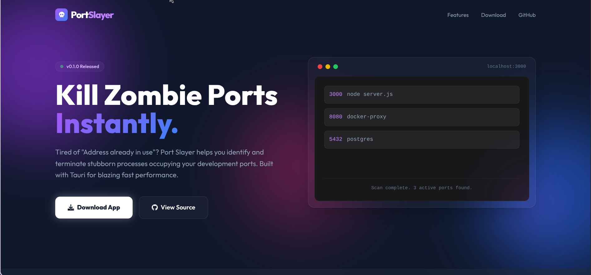

<div align="center">
  <h1>🗡️ Port Slayer</h1>
  <p><strong>Kill occupied port processes quickly and boost your developer workflow</strong></p>
  
  <a href="https://www.youtube.com/watch?v=eUua5GfjaEQ">Showcase Video</a>
  
  
  
  
  
</div>

---

## 🚀 Overview

**Port Slayer** is a lightweight, blazingly fast desktop application that helps developers quickly identify and terminate processes occupying specific ports. No more fumbling with terminal commands like `lsof` or `netstat` — just search, find, and kill with a single click!

Built with **Tauri 2.0**, **React 19**, and **Rust**, Port Slayer combines the best of web technologies with native performance.

---

## ✨ Features

- 🔍 **Smart Search** — Filter processes by name, PID, port number, or command
- ⚡ **Instant Kill** — Terminate stubborn processes with one click
- 📊 **Process Overview** — View running processes with their PIDs, ports, and commands
- 🎯 **Status Filtering** — Filter by running or stopped processes
- 🔄 **Real-time Refresh** — Update the process list on demand
- 🪶 **Lightweight** — Minimal resource footprint thanks to Tauri
- 🛡️ **Native Performance** — Rust backend ensures speed and reliability
- 🎨 **Modern UI** — Clean, intuitive interface built with React

---

## 📦 Installation

### Download Pre-built Binaries

Choose the package for your Linux distribution:

| Format                   | Download                                                                                |
| ------------------------ | --------------------------------------------------------------------------------------- |
| **AppImage**             | [port-slayer.AppImage](https://github.com/mrayushmehrotra/port-slayer/releases)         |
| **Debian/Ubuntu (.deb)** | [port-slayer_0.1.0_amd64.deb](https://github.com/mrayushmehrotra/port-slayer/releases)  |
| **Fedora/RHEL (.rpm)**   | [port-slayer-0.1.0.x86_64.rpm](https://github.com/mrayushmehrotra/port-slayer/releases) |

### Build from Source

#### Prerequisites

- [Node.js](https://nodejs.org/) (v18+)
- [Rust](https://rustup.rs/) (latest stable)
- [Tauri CLI](https://tauri.app/v1/guides/getting-started/prerequisites/)

#### Steps

```bash
# Clone the repository
git clone https://github.com/mrayushmehrotra/port-slayer.git
cd port-slayer

# Install dependencies
npm install
# or with bun
bun install

# Run in development mode
npm run tauri:dev

# Build for production
npm run tauri:build
```

---

## 🖥️ Usage

1. **Launch Port Slayer**
2. **Search** for a process by typing in the search box (e.g., `node`, `python`, `docker`, or a port number like `3000`)
3. **Filter** by status using the filter buttons (All / Running / Stopped)
4. **Kill** the process by clicking the "Kill" button next to it
5. **Refresh** the list anytime using the "Refresh" button

---

## 🛠️ Tech Stack

| Layer           | Technology                                        |
| --------------- | ------------------------------------------------- |
| **Frontend**    | React 19, TypeScript, Vite                        |
| **Backend**     | Rust, Tauri 2.0                                   |
| **System Info** | [sysinfo](https://crates.io/crates/sysinfo) crate |
| **Bundling**    | Tauri Bundler (AppImage, DEB, RPM)                |

---

## 📁 Project Structure

```
port-slayer/
├── src/                    # React frontend
│   ├── App.tsx            # Main application component
│   ├── App.css            # Styles
│   └── main.tsx           # Entry point
├── src-tauri/             # Rust backend
│   ├── src/
│   │   ├── lib.rs         # Tauri commands
│   │   └── main.rs        # Application entry
│   ├── Cargo.toml         # Rust dependencies
│   └── tauri.conf.json    # Tauri configuration
├── public/                # Static assets
└── package.json           # Node dependencies
```

---

## 🤝 Contributing

Contributions are welcome! Feel free to:

1. Fork the repository
2. Create a feature branch (`git checkout -b feature/amazing-feature`)
3. Commit your changes (`git commit -m 'Add amazing feature'`)
4. Push to the branch (`git push origin feature/amazing-feature`)
5. Open a Pull Request

---

## 📄 License

This project is licensed under the MIT License - see the [LICENSE](LICENSE) file for details.

---

## 👨‍💻 Author

**Ayush Mehrotra**

- GitHub: [@mrayushmehrotra](https://github.com/mrayushmehrotra)

---

<div align="center">
  <p>Made with ❤️ and ☕</p>
  <p><strong>Stop hunting. Start slaying.</strong></p>
</div>
